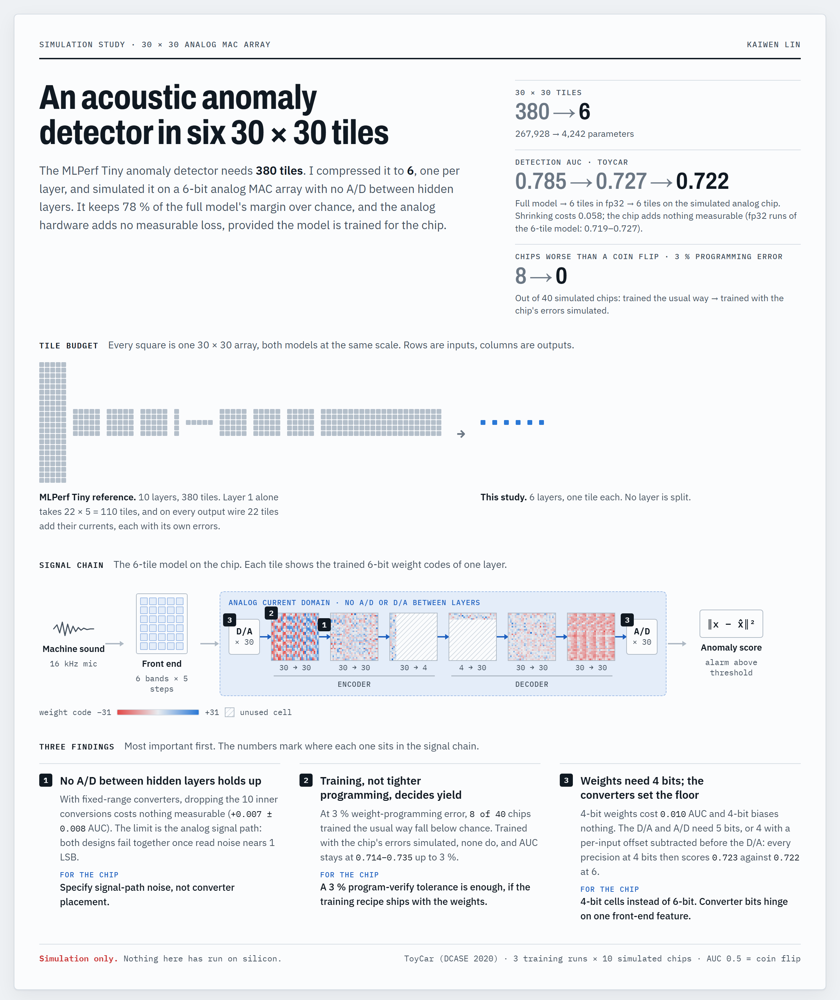

# Machine-Sound Anomaly Detection on a 30 × 30, 6-bit Analog MAC Array

*A simulation study · Kaiwen Lin · KaiwenLin@utexas.edu*

*Click the poster for the interactive version, with every simulated chip plotted.*

**The short answer.** A standard machine-sound anomaly detector needs 380 arrays of 30 × 30 weights. Shrunk to
6 arrays, one per layer, and run on a simulated 6-bit analog chip with no converters between layers, it keeps
78 % of its detection margin above chance (AUC 0.785 → 0.722). Almost all of that loss comes from shrinking
(0.727 in ideal digital arithmetic); the analog chip adds nothing measurable, provided the model is trained
with the chip's imperfections simulated. Nothing here has been tested on silicon.

## The question

The chip computes one neural-network layer per 30 × 30 array of stored weights, a *tile*, in analog current,
with no A/D or D/A conversion between layers. That saves power and area, but errors pass from layer to layer
uncorrected. I asked three things:

1. Does a useful anomaly detector fit? The MLPerf Tiny benchmark model needs 380 tiles.
2. What does each hardware limit cost: 30 inputs, 6-bit precision, programming error, chip-to-chip variation,
   analog noise, no converters between layers?
3. What must the hardware and the training each guarantee, so that *every* chip works?

## Three findings

### 1. Removing the converters between layers holds up; the analog noise sets the limit

I compared the chip's design, with conversions only at the two ends of the network, against a conventional one
that converts at every layer boundary: 2 conversions against 12. With converters modelled as real ones are,
with a fixed range, dropping the 10 inner conversions costs nothing measurable (+0.007 ± 0.008 AUC).

What matters is the noise of the analog signal path. At about one converter step (1 LSB) of noise, *both*
designs fail together (0.574 against 0.575). How much noise is tolerable depends on its nature:

- If noise grows with the signal, the budget is about half a converter step.
- If it is a fixed floor, the network learns to use more of its signal range; 40 dB of dynamic range was still
  enough, and the true limit is lower.
- If noise scales with each individual signal value, removing the inner converters does cost 0.016.

**For the chip:** specify the noise of the signal path, not where the converters sit.

### 2. Training, not tighter programming, decides yield

Weight programming is never exact. Trained the usual way and then loaded onto the chip, the *average* chip still
looks acceptable, but individual chips fail: at 3 % programming error, 8 of 40 simulated chips do worse than a
coin flip, and the worst scores 0.311. Trained with the chip's imperfections simulated (hardware-aware
training), none do, and AUC holds at 0.714–0.735 for any programming error up to 3 %. The spread between chips
narrows up to 5.9×.

*Right: the worst simulated chip. Trained normally (red), it sits at a coin flip even without programming
error and falls well below it from 1 %. Trained for the chip (blue), it holds.*

**For the chip:** a program-verify tolerance of about 3 % is enough, provided the training recipe ships with
the weights.

### 3. Weights need 4 bits; the converters set the floor

Lowering one precision at a time shows where the bits are needed. Weights at 4 bits cost 0.010 AUC, and biases
at 4 bits cost nothing. More than 6 bits buys nothing anywhere. The two converters are the real floor: at 5
bits they cost nothing, but at 4 bits detection falls to 0.570.

The reason is simple. Sound features sit at a large constant level with small fluctuations on top, and a
4-bit converter step is larger than the fluctuation it must carry. Subtracting each input's average level
before the D/A, and adding it back after the A/D, shrinks the needed range 3.6×. A chip with 4-bit weights,
biases *and* converters then matches the 6-bit one (0.723 against 0.722).

**For the chip:** use 4-bit cells instead of 6-bit ones. Whether the converters can also drop to 4 bits
depends on one front-end feature, the per-input offset.

## Also found

- **Spend the 30 inputs on time, not frequency.** 6 bands × 5 moments beat 30 bands × 1 moment by +0.068 AUC.
  Leaky integrators with time constants of 128 ms or less work as well as stored frames.
- **Adding noise during training is a regulariser.** A model trained without it loses 0.087 AUC even on a
  perfectly quiet chip, and the same trick helps in plain digital arithmetic too. Per-chip calibration after
  manufacturing then adds almost nothing (+0.001 to +0.006) and can be dropped from the production flow.
- **Set the alarm threshold on a real chip.** Chip noise raises every anomaly score 1.8×, so a threshold set in
  simulation flags every clip. Set on one reference chip, it holds 8–13 % false alarms on nine others
  (target 10 %).
- **The conclusions survive a more realistic simulator:** fixed converter ranges, a saturating activation and
  three kinds of analog noise. The one exception is noted in finding 1.

## How it was tested

- **Task:** the MLPerf Tiny anomaly detector on toy-car recordings (DCASE 2020 Task 2): an autoencoder trained
  only on healthy machines that flags recordings it cannot rebuild well. I first reproduced its published result.
- **Shrinking:** 10 layers became 6, with no layer larger than one tile. Splitting a layer's *inputs* across
  tiles is where accuracy is lost, because several tiles add their errors on one wire. The price is 30 input
  values instead of 640.
- **Chip model:** every layer gets 6-bit rounding of weights, signals and biases; weight-programming error;
  a fixed per-chip error pattern; analog noise; and converters only where they are placed.
- **Measurement:** AUC, where 0.5 is a coin flip and 1.0 is perfect. Every result covers 3 or 4 trainings ×
  10 simulated chips. I always look at the worst chip as well as the average, and I compare designs on the same
  training runs.

## What the ML side hands to the hardware side

The whole handoff fits on a page: the tile map, 4,242 weight and bias codes, one scale per tile, a gain and
offset per channel, the fixed converter ranges (plus per-input offsets for 4-bit converters), the alarm
threshold measured on a reference chip, and the noise levels the model was trained against. The last item is
easy to forget: a model is only valid on chips no noisier than it was trained for.

## What this does not show

- **Simulation only.** Noise levels are assumptions or stress tests, not measurements of a real chip.
- **One modest benchmark.** At 10 % false alarms the detector catches about 37 % of toy-car faults. The
  relative costs above should transfer, but the absolute numbers belong to this dataset. Industrial recordings
  (MIMII) would be a stronger test.
- **Not modelled:** power, temperature, weight drift, gain and offset errors in the analog path, or a front end
  simulated from the raw waveform.

## Questions for the hardware team

1. **Is the analog read noise a fixed floor, or proportional to the signal?** It sets the noise budget and
   decides whether removing the inter-layer converters stays free.
2. **Is subtracting a per-input offset before the D/A cheap in your front end?** It decides whether the
   converters can drop from 6 to 4 bits.
3. **How many 30 × 30 arrays are on a die, and can one drive the next directly in analog?** The 6-tile design
   depends on it.

## More

- [Full report](docs/REPORT_full.md): method, every table and figure, calibration and handoff details.
- [assumptions.md](assumptions.md): every modelling assumption and its status.
- [constraint-study/](constraint-study/): code, data preparation, reproduction commands and 101 unit tests.
