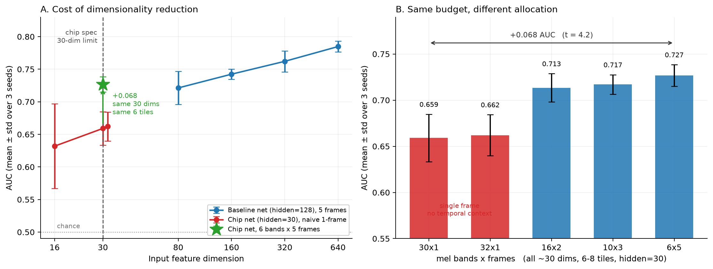
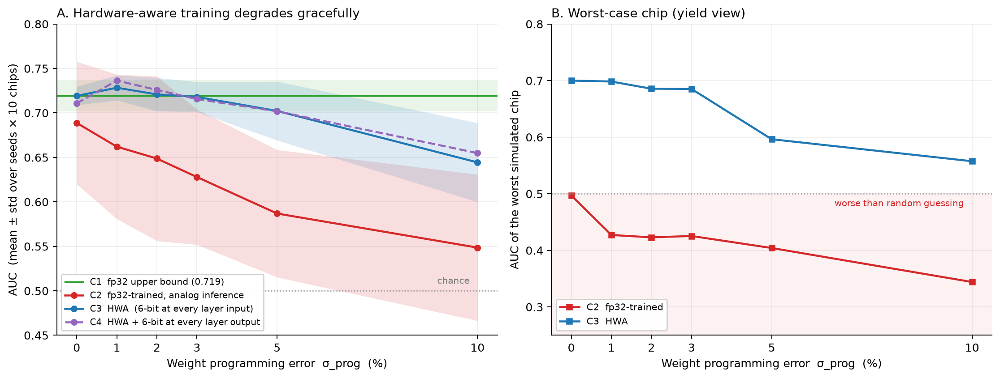
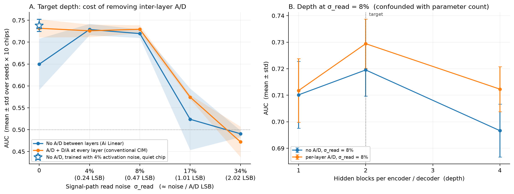
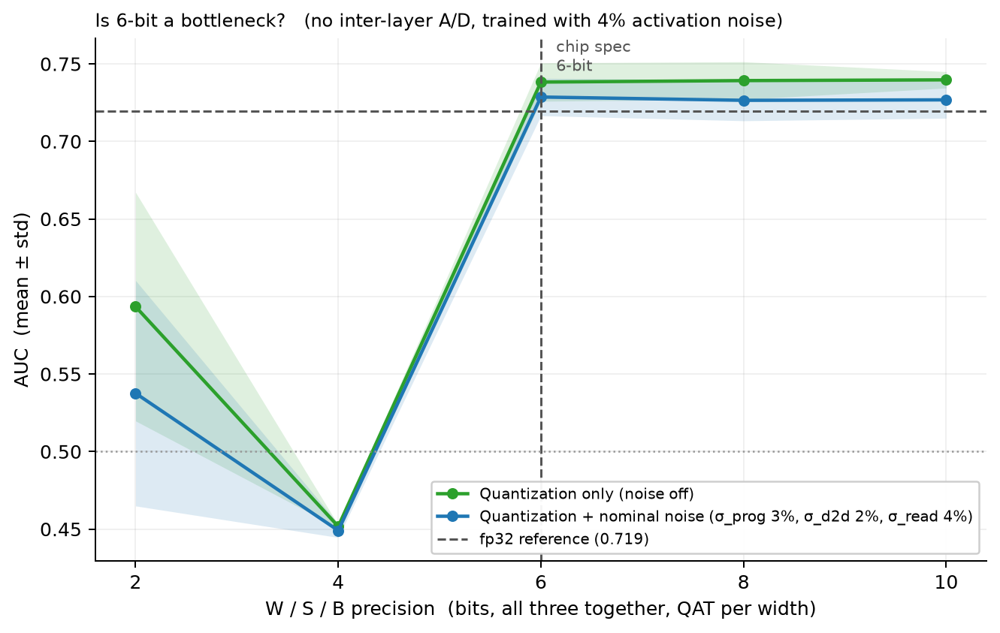

# Feasibility of a 30 × 30, 6-bit Analog MAC Array for Machine Acoustic Anomaly Detection

*A simulation study — September 2026*

> **Scope and status.** Independent study based on publicly available information; not affiliated with
> or endorsed by Ai Linear. **Nothing in this report has been verified on silicon.** Hardware parameters
> are inferred from public test-chip specifications or taken from the literature; each one is listed
> with its status in [assumptions.md](assumptions.md). The code, configurations and aggregated results
> behind every number are in [`constraint-study/`](constraint-study/); the [README](README.md) explains
> how to reproduce them.

---

## Summary

The MLPerf Tiny anomaly-detection reference model — a fully connected autoencoder with a 640-dimensional
input — occupies **380 tiles** of a 30 × 30 crossbar, and a single one of its layers needs 110. This study
compresses it to **6 tiles** and evaluates it on a behavioural model of a 6-bit analog MAC array with no
A/D or D/A conversion between hidden layers, across 10 simulated chips and at least three training seeds
per condition. Task: ToyCar machine-sound anomaly detection (DCASE 2020 Task 2).

1. **A 6-tile model is viable.** Deployed on the simulated array (6-bit W/S/B, 3 % programming error,
   2 % device mismatch, signal-path noise, no inter-layer A/D) it reaches **AUC 0.729 ± 0.012** — on par
   with the same network in fp32 (0.720–0.727) and retaining about 80 % of the above-chance
   discrimination of the 380-tile reference (0.785 ± 0.008).
2. **Spend the input budget on time, not frequency.** With the same 30 dimensions and 6 tiles, 6 mel
   bands × 5 frames beats 30 bands × 1 frame by **+0.068 AUC** (t = 4.2). An analog front end can
   supply temporal context through leaky integrators without spending feature dimensions.
3. **Programming error up to 3 % is nearly free — with hardware-aware training (HWA).** AUC stays at
   0.718–0.728 for σ_prog ≤ 3 %. Without HWA, chips that perform worse than random appear from
   σ_prog = 1 %, and the chip-to-chip spread is 2–7× larger.
4. **Removing inter-layer A/D costs ≤ 0.01 AUC while signal-path noise stays below ≈ 0.5 LSB.** Beyond
   ≈ 1 LSB both architectures fail together: the binding constraint is signal-path noise, not where the
   converters sit.
5. **The no-inter-layer-A/D architecture needs activation noise during training.** Without it the model
   is fragile to device noise (−0.08 AUC). The deciding factor is the training condition, not the
   deployed chip.
6. **6-bit W/S/B is sufficient; 4-bit collapses.** 6, 8 and 10 bits are indistinguishable
   (0.729 / 0.727 / 0.727); 4 bits falls below chance (0.449). The 5-bit point was not tested.

---

## 1. Target hardware and task

### 1.1 Constraints

| Constraint | Value used | Source |
|---|---|---|
| Weight array | 30 × 30 | Public NN-IC test-chip specification |
| W / S / B precision | 6 bit each | Same |
| A/D, D/A in hidden layers | None | Public statement: *"eliminates … costly A/D or D/A conversions in hidden layers"* |
| Weight storage | EEPROM or ReRAM (weights in memory) | Same |
| Supported operators | Fully connected, BNN, batch normalisation, scalar multiply — no convolution | Same |
| Operation | Asynchronous, clockless, current mode | Same |

The absence of convolution drives the choice of model (§2.1). The specification is marked
"work in progress" (4Q24); array size and precision are parameters throughout the code (A1).

### 1.2 Task

Machine-condition monitoring from sound — the application of Ai Linear's NSF SBIR Phase II iAcoustic™
programme. Benchmark: the ToyCar machine type of DCASE 2020 Task 2. The setting is unsupervised:
training uses normal sounds only.

---

## 2. Method

### 2.1 Reference model and data

The starting point is the MLPerf Tiny anomaly-detection reference, a fully connected autoencoder
`640 → [128]×4 → 8 → [128]×4 → 640` on log-mel features (128 bands, 5-frame sliding window,
n_fft 1024, hop 512). The anomaly score of a clip is the mean reconstruction MSE over all its windows.
Being convolution-free, the model maps directly onto a MAC array.

Data follow the MLPerf Tiny protocol: one model is trained on the development and additional training
sets (machine IDs 01–07, 7,000 normal clips) and evaluated on the development test set (IDs 01–04,
1,400 normal and 1,059 anomalous clips). Splits are by machine ID.

### 2.2 Evaluation protocol

- **AUC** is the primary metric; **pAUC** (FPR ≤ 0.1) is recorded for every run and follows the same
  trends. Values are means over machine IDs 01–04. All values are in `constraint-study/results/*.csv`.
- Every reported number is a **mean ± std over (training seeds × simulated chips)**: at least 3 seeds per
  condition (4 in §3.3) and 10 chips. Single-seed results proved unreliable (seed-to-seed std up to
  0.065) and are not used for any finding.
- **Convergence filter.** A training run is excluded if its final *validation* loss exceeds twice the
  median of comparable runs (the whole sweep in §3.3; runs of the same condition in §3.4–3.5). It is a
  training-time criterion — test AUC never enters it — and removed 1 of 24, 1 of 54 and 0 of 15 runs
  respectively.

### 2.3 Fast training configuration

The reference configuration (100 epochs, batch 512) takes 32 minutes per run. Sweeps use 80 epochs,
batch 2048, learning rate 0.002 and every second window — 5.6× faster — after validation against the
reference at its own operating point:

| Configuration | Time / run | AUC | pAUC | ΔAUC | ΔpAUC |
|---|---|---|---|---|---|
| Reference | 32.1 min | 0.7804 | 0.6737 | — | — |
| Fast, 40 epochs (rejected) | 2.9 min | 0.7736 | 0.6551 | −0.0068 | −0.0186 |
| **Fast, 80 epochs (used)** | 5.7 min | 0.7773 | 0.6660 | −0.0031 | −0.0077 |

The 40-epoch variant passed on AUC but not on pAUC; both metrics are required to stay within 0.01.

### 2.4 Behavioural model of the analog array

Each fully connected layer is replaced by a simulated analog layer (`src/models/analog.py`):

- **Quantisation.** Weights, signals and biases at 6 bits. Weight scales are per 30 × 30 tile, because
  weights are mapped onto each tile's conductance range. Straight-through estimator during training.
- **Device-to-device mismatch (D2D, σ_d2d = 2 %).** A multiplicative factor per weight, sampled **once
  per chip** and then frozen. During training it is redrawn every step, so that the model does not
  specialise to one chip. Chips are drawn from a random stream independent of the training seeds.
- **Programming / cycle-to-cycle error (σ_prog).** A multiplicative factor per weight, redrawn on every
  inference.
- **Signal-path read noise (σ_read).** Additive Gaussian noise on each layer's output with
  std = σ_read · mean|W·x|. At 6 bits the measured noise-to-LSB ratio is ≈ 5.93 σ_read, so
  4 / 8 / 17 / 34 % correspond to ≈ 0.24 / 0.47 / 1.0 / 2.0 LSB. This is a stress range, not a device
  parameter (A15).
- **A/D and D/A placement**, assigned per layer according to its position in the network:

| Mode | Where signals are quantised | Represents |
|---|---|---|
| `none` | Input D/A of the first layer and output A/D of the last layer only | No conversion between hidden layers (Ai Linear) |
| `per_layer` | Input D/A and output A/D of every layer | Conventional analog in-memory compute |
| `every_input` | Input of every layer | Placement used in §3.3 (see the note there) |

- **Hardware-aware training (HWA).** The network is trained with the analog layers in place —
  quantisation and noise in every forward pass — and deployed to 10 simulated chips without retraining.

Batch normalisation is kept as a separate affine stage, assumed to be a programmable gain and offset
(A5). The hidden non-linearity is ReLU (A4).

---

## 3. Results

### 3.1 Reproducing the reference

| | MLPerf Tiny | This study | Difference |
|---|---|---|---|
| AUC | 0.8009 | 0.7804 | −0.0205 |
| pAUC | 0.6722 | 0.6737 | +0.0015 |

pAUC matches almost exactly. The AUC gap is attributed to Keras ↔ PyTorch differences (initialisation,
batch-norm momentum convention, validation split) and was not chased (A9). Machine ID 03 is markedly
harder (AUC 0.618) than the others (0.806–0.856).

### 3.2 Input dimensionality (Figure 1)

fp32 training, fast configuration, 3 seeds.

**Tile budget.**

| | Input | Tiles (largest layer) | Parameters | AUC |
|---|---|---|---|---|
| Reference | 128 bands × 5 frames = 640 | 380 (110) | 267,928 | 0.7847 ± 0.0084 |
| **Target** | 6 bands × 5 frames = 30 | **6 (1)** | **4,242** | 0.7268 ± 0.0117 |

The target keeps 79.7 % of the reference's above-chance discrimination with 63× fewer tiles and
parameters. Its layers — 30 → 30 → 30 → 4 → 30 → 30 → 30 — each fit a single tile.

**Frequency resolution costs about 0.021 AUC per halving** (hidden width 128, 5 frames):
640 / 320 / 160 / 80 dimensions give 0.785 / 0.762 / 0.742 / 0.721.

**Temporal context matters more than frequency resolution** (≈ 30 dimensions, hidden width 30):

| Bands × frames | 6 × 5 | 10 × 3 | 16 × 2 | 30 × 1 | 32 × 1 |
|---|---|---|---|---|---|
| AUC | **0.727 ± 0.012** | 0.717 ± 0.011 | 0.714 ± 0.015 | 0.659 ± 0.026 | 0.662 ± 0.022 |

Every configuration with at least two frames scores ≥ 0.713; both single-frame configurations score
≤ 0.662. 6 × 5 versus 30 × 1: +0.068 (pooled SE 0.016, t = 4.2).

### 3.3 Programming error and hardware-aware training (Figure 2)

Target network, σ_d2d = 2 %, 4 seeds × 10 chips. Four arms: **C1** fp32 training and inference (upper
bound); **C2** fp32 training, analog inference (no HWA); **C3** HWA; **C4** HWA with an additional 6-bit
quantisation at every layer output.

> **Placement note.** These runs predate the `none` mode. C3 quantises the input of every layer to
> 6 bits (`every_input`), i.e. it has a conversion at every layer boundary and is closer to conventional
> in-memory compute than to the target architecture. The C3-versus-C4 comparison therefore only shows
> that an *extra* 6-bit quantisation costs nothing; removing inter-layer conversion is tested in §3.4.
> At the nominal operating point the target architecture, trained with the recipe of §3.4, reaches
> 0.729 ± 0.012 (§3.5) — consistent with C3's 0.718 ± 0.017 at σ_prog = 3 %.

| σ_prog | C2 (no HWA) | C3 (HWA) | C3 − C2 | Chip-std ratio C2 / C3 | Worst chip, C2 | Worst chip, C3 |
|---|---|---|---|---|---|---|
| 0 % | 0.689 ± 0.069 | **0.719 ± 0.010** | +0.030 | 6.6× | 0.497 | 0.700 |
| 1 % | 0.662 ± 0.081 | **0.728 ± 0.014** | +0.066 | 5.8× | 0.427 | 0.698 |
| 2 % | 0.649 ± 0.093 | **0.721 ± 0.019** | +0.072 | 4.9× | 0.423 | 0.686 |
| 3 % | 0.628 ± 0.076 | **0.718 ± 0.017** | +0.090 | 4.5× | 0.425 | 0.685 |
| 5 % | 0.587 ± 0.072 | **0.702 ± 0.033** | +0.115 | 2.2× | 0.404 | 0.596 |
| 10 % | 0.549 ± 0.082 | **0.644 ± 0.044** | +0.096 | 1.9× | 0.344 | 0.558 |

C1 = 0.720 ± 0.018. C4 − C3 lies within ±0.01 at every σ_prog.

- **Up to 3 % programming error is nearly free with HWA** (0.718–0.728 against 0.720 for fp32; given
  the evaluation dependence of A16, read this as "within about 0.01"). 5 % costs about 0.017, 10 %
  about 0.075.
- **Without HWA, the worst chip is below random from σ_prog = 1 %**, and the spread across chips — the
  yield view — is up to 6.6× larger.

### 3.4 Inter-layer A/D and signal-path noise (Figure 3)

Both architectures of §2.4 (`none` and `per_layer`), each trained with HWA under its own conditions;
σ_prog = 3 %, σ_d2d = 2 %; 3 seeds × 10 chips. Differences are paired by seed.

**Target depth (2 hidden blocks per encoder / decoder):**

| σ_read | ≈ noise / LSB | `none` | `per_layer` | Paired difference `none` − `per_layer` |
|---|---|---|---|---|
| 0 | 0 | 0.650 ± 0.058 | 0.732 ± 0.021 | −0.082 ± 0.057 (training recipe, see below) |
| 4 % | 0.24 | 0.729 ± 0.013 | 0.726 ± 0.014 | **+0.003 ± 0.004** |
| 8 % | 0.47 | 0.720 ± 0.010 | 0.729 ± 0.009 | **−0.010 ± 0.002** |
| 17 % | 1.0 | 0.524 ± 0.070 | 0.574 ± 0.005 † | −0.002 ± 0.004 † |
| 34 % | 2.0 | 0.491 ± 0.008 | 0.472 ± 0.035 | +0.019 ± 0.039 |

† One `per_layer` run removed by the convergence filter; 2 seeds.

**Depth, at σ_read = 8 %** (paired difference `none` − `per_layer`): −0.002 ± 0.008 with 1 block,
−0.010 ± 0.002 with 2, −0.016 ± 0.007 with 4. Depth is confounded with parameter count, because every
layer stays 30 wide to fit a tile.

- **Up to ≈ 0.5 LSB of signal-path noise, removing inter-layer A/D costs at most 0.01.** An inter-layer
  A/D does regenerate part of the noise — visible at 0.47 LSB — and the benefit grows with depth, but at
  the target depth it amounts to ≈ 0.01.
- **At ≈ 1 LSB both architectures fail together** (AUC 0.52–0.57), and at 2 LSB both are at chance.
  The binding constraint is the noise of the signal path, not where the converters sit.

**Training recipe for the no-inter-layer-A/D architecture.** At σ_read = 0 all three `none` models are
weak (0.597, 0.677, 0.675), and their chip-to-chip spread is 3–6× larger than at 4 %. Two explanations
were tested and each accounts for little of the gap: evaluation batching (≤ 0.0008 with all noise
disabled) and batch-norm statistics (per-chip re-estimation on normal data recovers +0.001 with one
minute of audio and +0.023 ± 0.047 with ten minutes). A cross-evaluation settles what matters:

| Trained with σ_read (rows) · deployed at σ_read (columns) | 0 (quiet chip) | 4 % |
|---|---|---|
| 0 | 0.665 ± 0.042 | 0.657 ± 0.051 |
| 4 % | **0.738 ± 0.014** | 0.726 ± 0.012 |

**Activation noise during training — not the noise of the deployed chip — decides robustness.** A model
trained with ≈ 0.24 LSB of activation noise is robust even on a perfectly quiet chip; a model trained
without it is fragile everywhere. `per_layer` does not need this step, plausibly because inter-layer
quantisation supplies the same perturbation during training; the mechanism is not established.
§3.5 reproduces the effect independently.

### 3.5 Bit width (Figure 4)

`none` architecture trained with 4 % activation noise; the W / S / B bit width is varied jointly, with
QAT at each width; 3 seeds × 10 chips. *Nominal* matches training (σ_prog 3 %, σ_d2d 2 %, σ_read 4 %);
*quantisation only* disables all noise.

| Bits | 2 | 4 | **6 (chip)** | 8 | 10 |
|---|---|---|---|---|---|
| Nominal | 0.538 ± 0.073 | 0.449 ± 0.005 | **0.729 ± 0.012** | 0.727 ± 0.013 | 0.727 ± 0.012 |
| Quantisation only | 0.593 ± 0.074 | 0.452 ± 0.001 | **0.738 ± 0.012** | 0.739 ± 0.012 | 0.740 ± 0.005 |

- **6 bits is sufficient.** 8 and 10 bits differ from 6 by −0.002 (nominal) and +0.001 (quantisation
  only).
- **4 bits collapses below chance**, with near-identical results across seeds (std ≤ 0.005): a
  systematic degenerate solution in which anomalous clips are reconstructed *better* than normal ones.
  The cliff lies between 4 and 6 bits; 5 bits was not tested, so the margin of the 6-bit specification
  is unknown. The mechanism was not investigated.
- **Independent reproduction of the training recipe.** An earlier run of this sweep trained without
  activation noise and gave 0.654 ± 0.044 / 0.642 ± 0.060 / 0.664 ± 0.047 at 6 / 8 / 10 bits
  (nominal) — 0.06–0.085 lower, with about 4× the spread.

---

## 4. Implications for chip design

Conditional on the assumptions in [assumptions.md](assumptions.md):

1. **A 30 × 30, 6-bit array can host this task** in 6 tiles, with every layer in a single tile.
   Porting the digital reference directly is not an option: its first layer alone needs 110 tiles.
2. **Give the analog front end temporal memory rather than many bands.** Six bands with five frames of
   context beat thirty bands of one frame at equal dimension. Configurable time constants (leaky
   integrators) deliver this without spending feature dimensions or tiles.
3. **A program-verify tolerance of ≈ 3 % is enough; 5 % is acceptable.** Tighter programming buys no
   measurable accuracy but costs programming time, which scales with the number of weights and hence
   with production-test cost.
4. **Treat hardware-aware training as mandatory** — and for the no-inter-layer-A/D architecture, include
   activation-noise injection. Without HWA, chips worse than random appear at 1 % programming error;
   without the injection, the no-A/D architecture loses ≈ 0.08 AUC and its chip spread grows 3–6×.
5. **Keep signal-path noise between hidden layers below ≈ 0.5 LSB-equivalent** (σ_read ≲ 8 % of the mean
   signal, i.e. SNR ≳ 22 dB against the mean signal level). In that range, dropping inter-layer
   converters costs ≈ 0.01 while saving their power and area; at ≈ 1 LSB no converter placement
   recovers the accuracy.
6. **6-bit W/S/B is the right precision.** More bits buy nothing and 4 bits fails; test 5 bits before
   considering a reduction.

---

## 5. Limitations

- **Simulation only.** Noise magnitudes come from the literature or are stress ranges (σ_read); none is
  measured on the target process (A2, A15).
- **Not modelled:** retention drift (EEPROM, ReRAM and PCM differ fundamentally), temperature, signal
  saturation, and a saturating hidden non-linearity — the simulation uses ReLU (A4).
- **Quantisation scale.** Activation D/A and A/D use a dynamic per-batch scale rather than a fixed
  calibrated range, so results depend on evaluation batch composition by up to ≈ 0.01 AUC for placements
  with many conversion points (≤ 0.0008 for `none`) (A16). No finding with a gap ≥ 0.03 is affected.
- **Figure 2 placement.** §3.3 uses per-layer input quantisation; only its nominal operating point was
  cross-checked against the target architecture.
- **Statistics.** 3–4 seeds per condition; gaps below ≈ 0.03 are not claimed unless paired differences
  are tight. Activation-noise-trained models evaluate ≈ 0.02 above the fp32 baseline (0.738–0.740
  versus 0.720); with shared seeds and this sample size that is not established — a dedicated
  fp32 + noise-injection control would settle it.
- **Unexplained:** the mechanism of the training-recipe effect, and of the 4-bit collapse.
- **Protocol.** Sweeps use the validated fast configuration (A8); the reproduced reference is 0.02 AUC
  below the published value (A9). HWA training occasionally collapses (1 of 24 and 1 of 54 runs); such
  runs are removed by the validation-loss filter.
- **Not covered:** the 80 × 80 binary array; a learnable analog front end (features are digital log-mel);
  machine types other than ToyCar (MIMII would be closer to industrial equipment); heart-sound data;
  multi-tile cascading, deferred because its cost depends on whether read noise is absolute or
  signal-proportional; power and energy.

---

## 6. Open questions for the hardware team

The answers would change the conclusions most. The full list is in
[assumptions.md](assumptions.md#e-open-questions-for-the-hardware-team).

1. Are the taped-out array size and precision still 30 × 30 and 6 bits?
2. What weight-error distribution does the program-verify tolerance produce?
3. What are the noise, offset and gain error of the analog path between hidden layers — and is read
   noise absolute or proportional to the signal?
4. What is the actual hidden-layer non-linearity?
5. Is multi-tile cascading supported, and how are partial sums combined?
