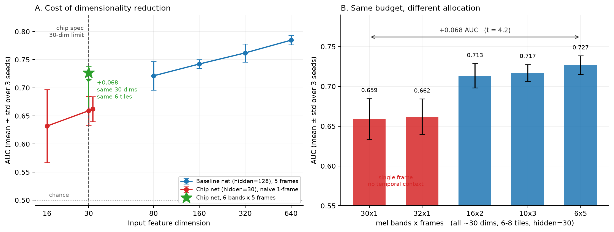
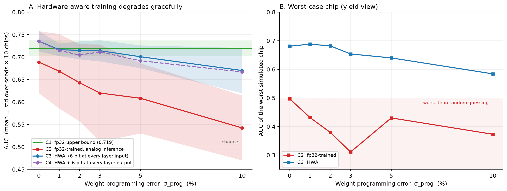
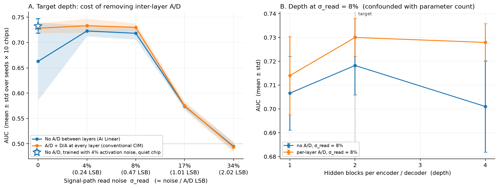
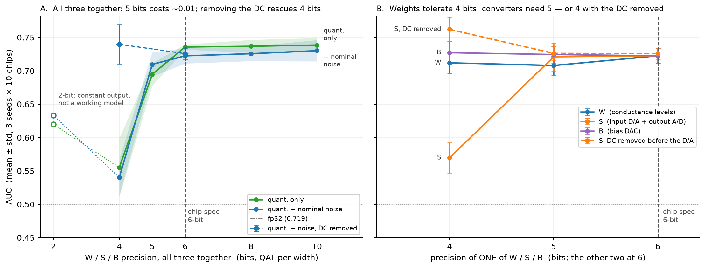

# 30 × 30、6-bit 模拟 MAC 阵列用于机器声学异常检测的可行性

*一项仿真研究 —— 第 2 版，2026 年 9 月 23 日（取代 9 月 12 日的版本）*

*作者：KaiwenLin —— KaiwenLin@utexas.edu*

*这是英文详细版 [REPORT_full.md](REPORT_full.md) 的中文翻译，数字与英文版逐一对应。精简版见
[REPORT.md](../REPORT.md)。*

> **仅为仿真 —— 没有任何内容在 silicon 上验证过。** 硬件参数来自公开的模拟存内推理测试芯片规格，或取自文献；
> 每一项及其状态都列在 [assumptions.md](../assumptions.md) 里。每个数字背后的代码、配置和聚合结果都在
> [`constraint-study/`](../constraint-study/)。

## 与第 1 版相比的变化

- **结论 6 是错的。** 量化训练的 straight-through estimator 有 bug：所有被取整到最高量化电平的值都拿不到梯度，
  而不只是真正被截断的值。所有量化训练中，输出层的 bias 基本没有训练；在 4 和 5 位权重下，输出层权重也被冻结。
  第 1 版报告为"低于随机"的 4-bit 点，其实是一个根本没训起来的模型。修复后只在值被截断时才截断梯度，
  并有 4 个回归测试覆盖。更正后的结果见 §3.4。
- **所有量化结果都用修复后的代码重新训练了** —— 共 114 个 run，收敛过滤器没有剔除任何一个；下面修订的器件模型
  另外新增 60 个。结论 1、3、5 和
  §4.2 成立，个别数字有小幅变化。结论 4 实质成立，但需要重新表述：去掉层间 A/D 的代价约为 0.01，而不是
  "至多 0.01"，而且它的噪声预算取决于噪声模型。
- **修订的器件模型**（§3.5）：用固定的标定转换器量程代替按 batch 计算的量程，加入饱和的隐藏层非线性，
  以及三种读噪声模型。在固定转换器量程下，去掉层间 A/D 没有可测的代价。
- **新结果**：leaky integrator 前端（§3.1）；D/A 前的逐通道偏置，让转换器能降到 4 bit（§3.4）；
  转换器满量程数值（§4.1）；以及判决阈值该怎么定（§4.3）。

第 1 版的图仍保留在仓库里；本版使用重新训练后的图。

---

## 摘要

MLPerf Tiny 异常检测参考模型 —— 十个全连接层，`640 → [128]×4 → 8 → [128]×4 → 640` —— 在 30 × 30 crossbar
上要占 **380 个 tile**，其中一层就要 110 个。本研究把它压缩成一个**六层**网络 `30 → [30]×2 → 4 → [30]×2 → 30`，
只占 **6 个 tile**（每层一个），并在一个隐藏层之间没有 A/D、D/A 转换的 6-bit 模拟 MAC 阵列行为级模型上评估它：
10 颗仿真芯片，每个条件 3 个训练 seed。任务：ToyCar 机器声异常检测（DCASE 2020 Task 2）。

1. **6 个 tile 就够。** 在仿真阵列上（6-bit W/S/B、3 % 编程误差、2 % 器件失配、信号通路噪声、没有层间 A/D），
   压缩后的模型达到 **AUC 0.722 ± 0.012** —— 与同一网络的 fp32 相当（0.720–0.727），相当于 380-tile 参考模型
   （0.785 ± 0.008）高出随机水平那部分的约 78 %。在所有修订的器件模型下，它都保持在 0.70–0.73。
   （§2.2、§3.1、§3.5）
2. **输入预算花在时间上，而不是频率上。** 维度相同时，6 个 mel band × 5 帧比 30 个 band × 1 帧高
   **+0.068 AUC**（t = 4.2）。时间常数不超过约 128 ms 的 leaky integrator 提供时间上下文的效果和存帧一样好，
   而且不需要缓存帧。（§3.1）
3. **Hardware-aware training 是必需的，它的回报是良率。** 用了它，编程误差不超过 3 % 时 AUC 保持在 0.714–0.735
   —— 所以约 3 % 的 program-verify 容差就够了。不用它，从 1 % 起，十颗仿真芯片里最差的一颗就低于随机，
   芯片间的离散度最多宽 5.9 倍。（§3.2）
4. **转换器放在哪里不是约束，信号通路的噪声才是。** 在与信号成比例的噪声低于约 0.5 LSB 时，去掉层间 A/D 的代价
   约为 0.01 AUC（−0.010 ± 0.019 和 −0.012 ± 0.012）；在固定转换器量程下（真实转换器就是这样），代价在噪声范围内
   （+0.007 ± 0.008）。约 1 LSB 时两种放置一起失效。噪声预算有多大，取决于噪声模型：在固定的噪声底下，
   网络会利用自己的量程余量，40 dB 的单列动态范围仍然够用。（§3.3、§3.5）
5. **决定鲁棒性的是训练时的激活噪声，而不是部署芯片的噪声。** 不加它，没有层间 A/D 的模型即使在完全安静的
   芯片上也损失 0.087 AUC，逐片标定也补不回来。这个效应是正则化：在纯 fp32 下也会出现。训练配方应当和权重一起
   写进规格。（§3.3、§4.2）
6. **位宽的下限由转换器决定，而不是权重。** 权重和 bias 降到 4 bit 都没问题（−0.010 和 +0.005）。两个转换器需要
   5 bit —— 或者 4 bit，前提是在 D/A 之前减去逐通道偏置：log-mel 特征大部分是直流，去掉它，转换器满量程就缩小
   3.6 倍。加上偏置、在固定转换器量程下，4-bit W/S/B 与 6 bit 相当（0.723 ± 0.016）。（§3.4）

---

## 1. 目标与任务

| 约束 | 数值 |
|---|---|
| 权重阵列 | 30 × 30 |
| W / S / B 精度 | 各 6 bit |
| 隐藏层的 A/D、D/A | 无 |
| 权重存储 | 存内（EEPROM 或 ReRAM）；推理时权重固定 |
| 算子 | 全连接、batch normalisation、标量乘法 —— 没有卷积 |
| 运行方式 | 异步、无时钟、电流模式 |

没有卷积决定了模型的类别；30 × 30 阵列决定了其余的一切。两者在代码里都是参数，所以每个结果都可以针对不同的阵列
重新计算（A1）。

**任务：** 基于声音的无监督机器状态监测 —— 只用正常片段训练，用重构误差打分。基准：DCASE 2020 Task 2 的 ToyCar
机型，与 MLPerf Tiny 所用的相同。

---

## 2. 方法

### 2.1 参考模型、数据与流程

起点是 MLPerf Tiny 异常检测参考模型：一个全连接自编码器 `640 → [128]×4 → 8 → [128]×4 → 640`，输入是 log-mel 特征
（128 个 band、5 帧滑窗、n_fft 1024、hop 512），一个片段的分数是它所有窗口重构 MSE 的均值。它没有卷积，可以直接
映射到 MAC 阵列上。数据遵循 MLPerf Tiny 的流程：用 machine ID 01–07 训练一个模型（7,000 个正常片段），在 ID
01–04 上评估（1,400 个正常、1,059 个异常）。这里复现得到 AUC 0.7804 / pAUC 0.6737，公开值为 0.8009 / 0.6722 ——
pAUC 相差 +0.0015，AUC 的差距归因于 Keras ↔ PyTorch 的差异，没有深究（A9）。

**流程。** AUC 是主指标；每个 run 都记录 pAUC（FPR ≤ 0.1），趋势与 AUC 一致。每个报告的数字都是跨训练 seed ×
10 颗仿真芯片的 mean ± std，每个条件 3 个 seed（§3.2 为 4 个）—— 单 seed 的结果不可靠，seed 间 std 可达 0.065。
条件之间的比较都按 seed 配对。最终**验证集**损失超过同类 run 中位数两倍的 run 会被剔除；测试集 AUC 从不进入这个
过滤器。它在第 1 版里剔除了 93 个 run 中的 2 个，在本版一个也没有剔除（重新训练的 114 个 run，以及修订器件模型下的 60 个）。扫描使用更快的
训练配置，它在参考工作点上两个指标都与参考一致后才被采用（ΔAUC −0.003、ΔpAUC −0.008，快 5.6 倍；A8）。
所有数值都在 `constraint-study/results/*.csv`。

### 2.2 把网络映射到 tile 上

一个 `[out, in]` 的权重矩阵占 `ceil(out / 30) × ceil(in / 30)` 个 tile（`src/tiling.py`），但两个方向的切分代价并不相同：

- **输出方向的切分**把一层拆到计算不同输出的 tile 上。它们互不影响；代价是面积和编程时间。
- **输入方向的切分**把一个点积拆成必须相加的部分和。在模拟域，这个加法就是一根导线 —— 基尔霍夫电流定律 ——
  这正是 crossbar 吸引人的原因。但每个参与的 tile 都把自己的失配和读噪声加到同一个求和节点上。
  **输入方向的切分是精度被消耗的地方。**

目标网络比参考模型更浅也更窄 —— `30 → [30]×2 → 4 → [30]×2 → 30`，六个全连接层对十个：

| 阶段 | 参考模型（10 层） | Tile | 目标模型（6 层） | Tile |
|---|---|---|---|---|
| 输入层 | FC 640 → 128 | **110**（5 × 22） | FC 30 → 30 | 1 |
| 编码器块 | 3 × FC 128 → 128 | 3 × 25 = 75 | 1 × FC 30 → 30 | 1 |
| 进入瓶颈 | FC 128 → 8 | 5 | FC 30 → 4 | 1 |
| 离开瓶颈 | FC 8 → 128 | 5 | FC 4 → 30 | 1 |
| 解码器块 | 3 × FC 128 → 128 | 3 × 25 = 75 | 1 × FC 30 → 30 | 1 |
| 输出层 | FC 128 → 640 | **110**（22 × 5） | FC 30 → 30 | 1 |
| **合计** | **10 层** | **380** | **6 层** | **6** |
| 最大的单层 | | 110 | | **1** |
| 参数量 | | 267,928 | | 4,242 |

参考模型的第一层光输入方向就需要 22 个 tile：每个输出节点上有 22 路部分和电流，各自带着失配和噪声。目标模型在
两个方向上都不切分，所以不需要多 tile 级联 —— 这是本研究唯一无法确认的硬件能力（A7）。

### 2.3 阵列的行为级模型

每个全连接层都被替换成一个仿真的模拟层（`src/models/analog.py`）：

- **量化**：权重、信号和 bias 都量化到 6 bit，权重尺度**按 30 × 30 tile** 计（权重被映射到每个 tile 的电导范围上）。
  训练时用 straight-through estimator；除非值被截断，否则梯度照常通过（第 2 版修正）。
- **器件间失配**（σ_d2d = 2 %）：每个权重一个乘性因子，每颗芯片抽样一次后冻结。训练时每步重新抽样，模型因此不能
  专门适应某一颗芯片；芯片来自一个与训练 seed 无关的随机流。
- **编程误差 / cycle-to-cycle 误差**（σ_prog）：每个权重乘性，每次推理都重新抽样。
- **信号通路读噪声**（σ_read）：加在每层输出上的加性高斯噪声，std = σ_read · 整个 batch 的 mean|W·x|。在 6 bit
  下测得噪声与 LSB 之比约为 5.93 σ_read，所以 4 / 8 / 17 / 34 % 分别约对应 0.24 / 0.47 / 1.0 / 2.0 LSB。这是
  **压力区间，不是器件参数**（A15）。
- **转换器放置**，按层在网络中的位置指定：

| 模式 | 在哪里量化信号 | 信号通路上的转换次数（6 层） |
|---|---|---|
| `none` | 第一层的输入、最后一层的输出 | 2 |
| `per_layer` | 每一层的输入和输出 | 12 |
| `every_input` | 每一层的输入 | 6 |

- **Hardware-aware training（HWA）：** 网络在模拟层就位的情况下训练 —— 每次前向都有量化和噪声 —— 然后不再重新训练，
  直接部署到 10 颗仿真芯片上。

Batch normalisation 作为单独的仿射级保留，假设它是可编程的增益和偏置（A5）。隐藏层非线性是 ReLU（A4）。

**修订的器件模型（§3.5）。** 三处改动，每处都可以开关，默认值逐位复现上面的模型：

- **固定转换器量程。** 每个 D/A 和 A/D 的满量程在训练时按 |信号| 第 99.9 百分位的滑动平均标定，评估时冻结；
  超出的值被截断。第 1 版用的是每个 batch 重新计算的 max-abs 尺度，真实转换器不会这样做（A16）。
- **饱和非线性。** clipped ReLU，即 `min(max(z, 0), 1)` —— 被偏置电流限幅的单极性电流镜的自然形状 —— 或者 tanh，
  即差分对的形状。饱和轨的位置本身无关紧要：激活前的 batch normalisation 有可学习的增益，能吸收它的任何缩放。
  重要的是饱和轨与噪声底之间的动态范围。
- **读噪声模型**，以硬件单位定义。U 是**单元满量程电流**：tile 最大的 |w| 乘以该层的输入范围 —— 第一层是 D/A
  满量程，饱和激活之后的隐藏层是饱和轨。*Absolute*：std = σ · U，与信号无关；单列动态范围为 20·log10(30 / σ)。
  *Proportional*：逐元素 std = σ · |W·x|。*Shot*：std = σ · √(U · |W·x|)，对应亚阈区电流。由于 U 由硬件决定，
  网络无法靠缩小信号来躲开 absolute 或 shot 噪声。

---

## 3. 结果

### 3.1 能放下什么（图 1）

fp32 训练，3 个 seed。这些结果不用量化训练，不受这次更正的影响。

| | 输入 | Tile（最大的层） | 参数量 | AUC |
|---|---|---|---|---|
| 参考模型 | 128 band × 5 帧 = 640 | 380（110） | 267,928 | 0.7847 ± 0.0084 |
| **目标模型** | 6 band × 5 帧 = 30 | **6（1）** | **4,242** | 0.7268 ± 0.0117 |

目标模型用少 63 倍的 tile 和参数，保留了参考模型高出随机水平那部分判别力的 79.7 %。它的六层 —— 激活宽度依次为
30 → 30 → 30 → 4 → 30 → 30 → 30 —— 各占一个 tile。频率分辨率每减半约损失 0.021 AUC（640 / 320 / 160 / 80 维
分别为 0.785 / 0.762 / 0.742 / 0.721）。

**30 根输入线怎么分配**（隐藏宽度 30）：

| Band × 帧 | 6 × 5 | 10 × 3 | 16 × 2 | 30 × 1 | 32 × 1 |
|---|---|---|---|---|---|
| AUC | **0.727 ± 0.012** | 0.717 ± 0.011 | 0.714 ± 0.015 | 0.659 ± 0.026 | 0.662 ± 0.022 |

至少有两帧的配置都 ≥ 0.713；两个单帧配置都 ≤ 0.662。6 × 5 对 30 × 1 是 +0.068（合并标准误 0.016，t = 4.2）。
这是关于前端而不是网络的结论：30 根输入线是稀缺资源，把它们花在少数几个 band、每个带几个时间采样上，比花在
精细分辨的瞬时频谱上更好。

**用 leaky integrator 代替存帧。** 拼接帧需要缓存；leaky integrator 只保留一个状态。把每个 band 的 5 帧换成 5 个
一阶低通输出，全部在同一时刻读出：

| 特征（6 band × 5 通道） | fp32 | 仿真芯片（6-bit、`none`、标称噪声） |
|---|---|---|
| 拼接 5 帧 | 0.730 ± 0.019 | 0.716 ± 0.005 |
| Leaky integrator，τ = 32–128 ms | **0.751 ± 0.014**（配对 +0.021 ± 0.008） | 0.703 ± 0.019（配对 −0.013 ± 0.016） |
| Leaky integrator，τ = 32–512 ms | 0.708 ± 0.017（配对 −0.022 ± 0.032） | — |

**时间常数不超过约 128 ms** 的积分器与存帧相当 —— fp32 下更好，仿真芯片上没有显著差别 —— 更长的反而有害。
在不用无源电容的设计里，短时间常数更便宜。*这里的积分作用在 log-mel band 上 —— 是"整流、积分、再压缩"的一阶
近似；这些共线的特征在默认学习率下训练不稳定，所以两组都用了低 4 倍的学习率。*

### 3.2 编程误差与 hardware-aware training（图 2）

目标网络，σ_d2d = 2 %，4 个 seed × 10 颗芯片。**C1** fp32 训练与推理（上界）；**C2** fp32 训练、模拟推理；
**C3** HWA；**C4** HWA，并在每层输出再加一次 6-bit 量化。

| σ_prog | C2（不做 HWA） | C3（HWA） | 最差芯片，C2 | 最差芯片，C3 |
|---|---|---|---|---|
| 0 % | 0.689 ± 0.069 | **0.735 ± 0.023** | 0.497 | 0.681 |
| 1 % | 0.669 ± 0.083 | **0.716 ± 0.014** | 0.431 | 0.688 |
| 2 % | 0.643 ± 0.086 | **0.715 ± 0.020** | 0.379 | 0.682 |
| 3 % | 0.620 ± 0.108 | **0.714 ± 0.024** | 0.311 | 0.654 |
| 5 % | 0.608 ± 0.078 | **0.701 ± 0.025** | 0.430 | 0.640 |
| 10 % | 0.542 ± 0.072 | **0.670 ± 0.050** | 0.373 | 0.584 |

C1 = 0.720 ± 0.018；C4 − C3 始终在 −0.011 … 0.000 之间。

- **用了 HWA，不超过 3 % 的编程误差几乎没有代价**（0.714–0.735，fp32 为 0.720）。相对 3 %，5 % 约损失 0.013，
  10 % 约损失 0.044。更紧的编程换不来精度，却要花编程时间，而编程时间随权重数增长，也就随测试成本增长。
- **均值是看错了的数字。** 不做 HWA 时，均值 0.62–0.69 看起来还能用，但从 1 % 编程误差起，最差的仿真芯片就
  低于随机 —— 出货时只有 0.43 的器件就是退货的器件。HWA 把芯片间离散度最多缩小 5.9 倍。

*放置说明：这组 run 在每一层的输入都量化，所以 C3 更接近常规存内计算，而不是目标架构；C3 对 C4 只说明多一次
量化没有代价。去掉层间转换在 §3.3 测试；在标称工作点上两者一致（0.714 ± 0.024 对 0.722 ± 0.012）。*

### 3.3 层间 A/D 与信号通路噪声（图 3）

两种放置，各自在自己的条件下做 HWA 训练；σ_prog = 3 %、σ_d2d = 2 %，3 个 seed × 10 颗芯片。差值按 seed 配对。

| σ_read | ≈ 噪声 / LSB | `none` | `per_layer` | 配对差 |
|---|---|---|---|---|
| 0 | 0 | 0.663 ± 0.077 | 0.728 ± 0.010 | −0.065 ± 0.052（训练配方，见下） |
| 4 % | 0.24 | 0.723 ± 0.011 | 0.733 ± 0.014 | **−0.010 ± 0.019** |
| 8 % | 0.47 | 0.718 ± 0.012 | 0.730 ± 0.008 | **−0.012 ± 0.012** |
| 17 % | 1.0 | 0.574 ± 0.006 | 0.575 ± 0.009 | −0.001 ± 0.005 |
| 34 % | 2.0 | 0.495 ± 0.008 | 0.494 ± 0.010 | +0.001 ± 0.004 |

**在约 0.5 LSB 以下，去掉层间转换器的代价约为 0.01 AUC** —— 第 1 版在 0.24 LSB 处报告的是 +0.003；重新训练后是
−0.010，seed 间离散度大了五倍。层间 A/D 确实能再生一部分噪声，而且这个效应随深度增大（1 / 2 / 4 个块时配对差为
−0.007 / −0.012 / −0.027，深度与参数量混杂）。约 1 LSB 时两种放置一起失效，2 LSB 时都处于随机水平。
**决定极限的是信号通路的噪声，而不是转换器的放置**，而且这个转折并不平缓：在 0.47 到 1.0 LSB 之间，AUC 从 0.72
跌到 0.57。

修订的器件模型（§3.5）带来两点限定。在固定转换器量程下，去掉层间 A/D 的代价在噪声范围内（+0.007 ± 0.008）：
这里 `per_layer` 表现出的一部分优势，来自它的十二个转换器每个 batch 都重新定量程，而真实转换器做不到。另外，
0.5 LSB 的预算只针对随信号成比例的噪声，也就是这里 σ_read 的定义；在固定的噪声底下，网络会把信号抬进可用的
量程余量里。

这给这个权衡的两边都标了价。公开的超低功耗模拟模块器件级数据显示，一个 A/D 转换器约 1 µA，一级放大器约 150 nA；
一个在每个层边界都做转换的六层网络，比只在输入和输出做转换的多出十次转换。**本研究不建模功耗，也不对功耗下任何
结论** —— 它只给出这个权衡在精度一侧的上界，约 0.01 AUC，前提是上面的噪声预算和下面的训练配方。

**训练配方。** σ_read = 0 时，三个 `none` 模型都很弱（0.610、0.669、0.710），芯片间离散度是 4 % 时的 4–9 倍。
交叉评估说明了原因：

| 训练时的 σ_read（行）· 部署时的 σ_read（列） | 0（安静芯片） | 4 % |
|---|---|---|
| 0 | 0.646 ± 0.088 | 0.648 ± 0.071 |
| 4 % | **0.733 ± 0.014** | 0.720 ± 0.013 |

**决定鲁棒性的是训练时的激活噪声，而不是部署芯片的噪声。** 用约 0.24 LSB 激活噪声训练的模型，即使在完全安静的
芯片上也是鲁棒的；不加噪声训练的模型在哪里都脆弱。机制是正则化，而不是训练与部署条件的匹配：在纯 fp32 下
—— 没有量化、没有器件噪声、无噪声评估 —— 同样的注入也会提高 AUC。

| fp32 训练时注入 | 无 | 激活噪声 2 % | 4 % | 8 % | 输入噪声 0.42 / 0.84 / 1.68 dB |
|---|---|---|---|---|---|
| AUC | 0.727 ± 0.012 | 0.730 ± 0.006 | **0.740 ± 0.003** | **0.754 ± 0.004** | 0.697 / 0.716 / 0.714 |
| 与"无"的配对差 | — | +0.003 | **+0.014 ± 0.009** | **+0.027 ± 0.016** | −0.030 / −0.011 / −0.013 |

到 8 % 收益仍在上升，所以 4 % 不一定是最好的配方。加在输入上的噪声没有帮助 —— 正则化作用在隐藏层激活上。
`per_layer` 不需要这一步，很可能是因为层间量化在训练时提供了类似的扰动。

### 3.4 位宽（图 4）

`none` 放置，训练时加 4 % 激活噪声（A17）；每个位宽各自做 quantization-aware training；3 个 seed × 10 颗芯片。
*标称*与训练条件一致（σ_prog 3 %、σ_d2d 2 %、σ_read 4 %）；*只量化*关掉全部噪声。

**三者一起降：**

| 位宽 | 2 | 4 | 5 | **6（芯片）** | 8 | 10 |
|---|---|---|---|---|---|---|
| 标称 | *0.633 ± 0.146* | 0.540 ± 0.027 | 0.710 ± 0.018 | **0.722 ± 0.012** | 0.726 ± 0.011 | 0.730 ± 0.016 |
| 只量化 | *0.620 ± 0.164* | 0.555 ± 0.044 | 0.695 ± 0.017 | **0.736 ± 0.004** | 0.737 ± 0.010 | 0.739 ± 0.011 |

**一次只降一项**，另外两项保持 6 bit：

| 位宽 | W（电导电平） | S（输入 D/A + 输出 A/D） | S，D/A 前减去逐通道偏置 | B（bias） |
|---|---|---|---|---|
| 4 | **0.712 ± 0.015** | 0.570 ± 0.023 | 0.762 ± 0.018 | **0.727 ± 0.017** |
| 5 | 0.708 ± 0.014 | 0.721 ± 0.021 | 0.726 ± 0.011 | 0.724 ± 0.013 |
| 6 | 0.722 ± 0.012 | ← | 0.726 ± 0.009 | ← |

- **权重和 bias 降到 4 bit 都没问题**（相对 6 bit 为 −0.010 和 +0.005）：电导电平从 64 个减到 16 个。
  6 bit 以上的分辨率换不来任何收益。
- **两个转换器决定下限。** 5 bit 时没有代价，4 bit 时失效。log-mel 特征是一个很大的直流电平（约 −26 dB，各通道
  从 −41 到 −10）加一个很小的起伏（约 3.5 dB）：转换器把量程花在了直流上，它 4-bit 的步长（8.4 dB）比要传的信号还大。
- **在 D/A 前减去逐通道偏置** —— 即每根输入线在训练集上的均值，在输出 A/D 之后加回 —— 转换器满量程缩小 3.6 倍
  （52.3 → 14.5 dB，见 §4.1），约 1.85 bit。有了它，4-bit 转换器没有代价。在固定转换器量程下复核（§3.5），
  三者都降到 4 bit 得到 **0.723 ± 0.016**，相对 6 bit 配对差 +0.000 ± 0.015；不加偏置则是 0.684 ± 0.019。
- 偏置那一列高出 6 bit 的部分不作为结论：更粗的输出 A/D 改变了异常分数的形状，在评估时对 6-bit 模型做同样的改动，
  AUC 也会上升约 0.02 —— 这是这个基准上分数的性质，不代表模型更好。
- *2 bit 不是能工作的模型*：经过 D/A 后输入只剩两个电平，输出是常数；它的 AUC（各 seed 在 0.52–0.82 之间）
  衡量的只是每个片段离一个任意固定模板有多远。

*更正。* 第 1 版报告 4 bit 为 0.449，低于随机，5 bit 未测。那些 4 和 5 bit 的模型根本没训起来 —— 它们的验证损失
一直是正常 run 的 15–35 倍 —— 因为 straight-through estimator 不给取整到最高量化电平的值梯度（见"与第 1 版相比的
变化"）。

### 3.5 对器件模型的鲁棒性

目标配置，3 个 seed × 10 颗芯片，每个模型都在它被评估的器件模型下训练；σ_prog 3 %、σ_d2d 2 %。配对差的对照是
同一个 seed 在第 1 版器件模型（§2.3）下、用修正后训练得到的结果。

| 器件模型 | `none` | `per_layer` | `none` − `per_layer` |
|---|---|---|---|
| 固定转换器量程 | 0.724 ± 0.017 | 0.717 ± 0.010 | **+0.007 ± 0.008** |
| + clipped ReLU | 0.724 ± 0.025 | 0.720 ± 0.008 | +0.004 ± 0.022 |
| + absolute 噪声 σ 0.03（60 dB） | 0.719 ± 0.010 | 0.721 ± 0.008 | −0.003 ± 0.002 |
| + shot 噪声 σ 0.02 | 0.710 ± 0.023 | 0.718 ± 0.018 | −0.008 ± 0.026 |
| + proportional 噪声 4 % | 0.702 ± 0.018 | 0.718 ± 0.010 | **−0.016 ± 0.006** |
| 用 tanh 代替 clipped ReLU，absolute σ 0.03 | 0.727 ± 0.015 | — | — |

- **固定转换器量程**对 `none` 没有影响（配对 +0.001），却让 `per_layer` 损失 0.017：用物理的转换器，去掉层间 A/D
  没有可测的代价。
- **非线性的形状在这里无关紧要**：clipped ReLU 对 ReLU 为 +0.0005（`none`）和 +0.003（`per_layer`）；tanh 对
  clipped ReLU 为 +0.008。
- **在几种噪声模型中，只有逐元素 proportional 噪声会损失精度** —— 相对第 1 版模型约 0.02（配对 −0.021 ± 0.003）
  —— 也只有在它之下，去掉层间 A/D 才有可测的代价（−0.016 ± 0.006）。真实的读噪声是固定底还是与信号成比例，
  是 §6 的第三个开放问题。

**动态范围。** absolute 噪声、固定转换器量程、clipped ReLU；σ 以单元满量程电流 U 为单位：

| σ | 单列动态范围 | `none` | `per_layer` |
|---|---|---|---|
| 0.01 | 70 dB | 0.705 ± 0.038 | 0.726 ± 0.014 |
| 0.03 | 60 dB | 0.719 ± 0.010 | 0.721 ± 0.008 |
| 0.1 | 50 dB | 0.726 ± 0.021 | 0.703 ± 0.010 |
| 0.3 | 40 dB | 0.715 ± 0.041 | 0.737 ± 0.008 |

在 70 到 40 dB 之间没有出现转折，因为网络会适应。在训练好的模型上测量，平均信号与 U 之比在每一层都随噪声底
升高 —— 在瓶颈附近，从 σ 0.01 时的约 0.2 升到 σ 0.3 时的 0.9 —— 隐藏层激活顶在饱和轨上的比例从 1–9 % 升到
7–20 %（最后一层隐藏层直接连到输出、帮助合成输出的直流电平，这一比例在 50–75 %）。网络用自己的量程余量来守住
信噪比，而 §3.3 那种与信号成比例的噪声模型看不到这个权衡。**在这个任务上，40 dB 的单列动态范围就够了；真正的极限
更低，还没有测到** —— 40 dB 时已有一个 `none` 的 seed 降到 0.659。

---

## 4. 交付、标定与判决阈值

### 4.1 ML 一侧交付什么

对目标模型来说，交付物小到可以打印出来：

| 项目 | 内容 |
|---|---|
| Tile 映射 | 6 个 tile，每层一个；不共享 tile，没有部分和 |
| 权重和 bias 编码 | 有符号整数，4,242 个权重；规格为 6 bit，4 bit 就够（§3.4） |
| Tile 尺度 | 每个 tile 一个实数尺度 —— 它是 tile 电导范围的属性，不是层的属性 |
| BN 增益和偏置 | 每个通道一对，实数；假设可编程（A5） |
| 输入偏置 | 每根输入线一个值，在 D/A 前减去、在输出 A/D 后加回 —— 只在转换器要降到 4 bit 时需要（§3.4） |
| D/A 和 A/D 满量程 | 固定，按训练信号第 99.9 百分位标定：log-mel 单位下 **52.3 dB**（D/A）和 **52.3–53.4 dB**（A/D，随噪声模型而变）；加上输入偏置后为各通道均值附近的 **±14.5 dB** 和 **±13.6 dB**。测试样本中 0.12–0.14 % 被截断。 |
| 判决阈值 | 在参考芯片上用正常音频测定，而不是在仿真里算出（§4.3） |
| 训练条件 | 模型训练时所用的 σ_prog、σ_d2d 和激活噪声水平 |

最后一行是最容易从权重文件里漏掉、事后又很难重新找回的：一个模型只对非理想性不超过它训练时条件的芯片有效，
没有这些数字，工艺一旦变化，就没法对照现有模型来检查。

### 4.2 逐片标定值不值它的测试时间

Batch normalisation 是天然的标定手段。直接测量了在每颗芯片上用正常音频重估它的统计量（`scripts/probe_bn_calib.py`，
3 个 seed × 10 颗芯片）；窗口数后面给出了等价的连续录音时长：

| 模型 | 不标定 | 2,048 个窗口（约 1 分钟） | 20,480 个窗口（约 11 分钟） |
|---|---|---|---|
| `none`，训练时加 4 % 激活噪声 | **0.720 ± 0.011** | 0.720 ± 0.016 | 0.726 ± 0.009 |
| `none`，训练时不加 | 0.643 ± 0.078 | 0.641 ± 0.071 | 0.661 ± 0.065 |
| `per_layer`，σ_read 0 | 0.732 ± 0.010 | 0.730 ± 0.013 | 0.732 ± 0.010 |

- **训练配方对了，逐片标定几乎没有收益**（1 分钟音频 +0.001，11 分钟 +0.006）—— 生产流程里可以去掉这个逐片步骤
  和它的录音时间。
- **标定替代不了配方。** 对那个脆弱的模型，每颗芯片 11 分钟的音频只补回 0.089 差距中的 0.018，最差的芯片仍只有 0.469。

### 4.3 怎么定判决阈值

部署的检测器需要一个数，而不是一个 AUC。阈值按机器、以 10 % 误报率为目标，用一半正常测试片段来定 —— 代表安装时
录下、训练中没见过的音频 —— 再在另一半正常片段和全部异常片段上评估；10 颗芯片 × 3 个 seed，标称噪声，修正后的
训练、第 1 版器件模型。

| 阈值定在哪里 | 6-bit 模型：误报率 | 4-bit 加输入偏置：误报率 |
|---|---|---|
| 无噪声模型（仿真） | **100 %** | 8–16 % |
| 一颗参考芯片，用到另外九颗 | 8–13 % | 6–11 % |
| 每颗芯片在安装时各自定 | 8–11 % | 7–9 % |

- **阈值可以在芯片之间通用，但不能从仿真搬到 silicon。** 器件噪声让 6-bit 模型正常片段的分数升高 1.80 倍，所以不考虑
  噪声算出的阈值会把一切都判为异常。减去输入偏置后，这个偏移缩小到 1.05 倍。阈值应该在参考芯片上测定；逐片阈值
  收益很小。
- **在这个基准上，工作点并不出色。** 误报率 10 % 时，检测器能找出约 37 % 的异常；如果十个片段里有一个异常，
  precision 约为 0.30，百个里有一个时约为 0.04。这些绝对数字属于 AUC 约 0.72 的 ToyCar，而不属于架构；可以迁移的
  是上面的相对代价。

---

## 5. 局限

- **仅为仿真。** 噪声大小来自文献或是压力区间；没有一个是在目标工艺上测得的（A2、A15）。三种读噪声模型检验的是
  结论是否依赖噪声模型，而不是 silicon 遵循哪一种。
- **未建模：** 保持性漂移（EEPROM、ReRAM 和 PCM 的机制根本不同）、温度，以及层间信号通路的偏置与增益误差（A18）。
- **统计。** 每个条件 3 个 seed（§3.2 为 4 个）。§3.5 中约 ±0.02 以内的差异都不显著；在修订的器件模型下，`none`
  放置的 seed 间离散度更大（单个 seed 低至 0.66）。动态范围的极限没有找到。评估时 cycle-to-cycle 噪声的重抽样
  没有固定种子，所以重新评估会让结果变动约 0.002。
- **重跑的范围。** 编程误差和深度扫描用修正后的代码重新训练了，但没有在修订的器件模型下重复。
- **未覆盖：** 80 × 80 二值阵列；从波形开始仿真的模拟前端（leaky integrator 检验是在 log-mel band 上积分）；ToyCar
  以外的机型 —— 在 ToyCar 上，一个常数输出就能依常数不同拿到 0.52–0.82 的 AUC，所以 MIMII 会是更严格的检验；
  生物医学信号；多 tile 级联，它的代价现在有了模型（absolute 噪声按输入方向 tile 叠加），但还没跑；功耗与能量。

---

## 6. 给硬件团队的开放问题

这些问题的答案对结论影响最大；完整清单见
[assumptions.md](../assumptions.md#e-open-questions-for-the-hardware-team)。

1. 流片后的阵列尺寸和精度还是 30 × 30、6 bit 吗？
2. Program-verify 容差会产生什么样的权重误差分布？
3. 隐藏层之间模拟通路的噪声、偏置和增益误差是多少 —— 读噪声是固定底还是与信号成比例？它决定噪声预算、去掉层间
   A/D 是否免费（§3.5），以及多 tile 级联是否免费。
4. 隐藏层实际的非线性是什么，在哪里饱和？在这个任务上它的形状无关紧要（§3.5）；饱和轨与噪声底之间的动态范围才重要。
5. 支持多 tile 级联吗？部分和怎么合并？
6. 什么样的激活速率对应一个给定的信号通路噪声指标 —— 这是 §3.3 的精度预算和吞吐规格之间缺失的一环。
7. 在前端做 D/A 前的逐通道偏置便宜吗？它决定转换器能否从 6 bit 降到 4 bit（§3.4）。
